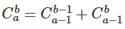
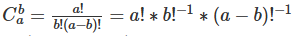
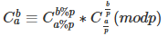
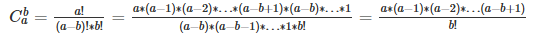

## 基础算法

### 快速排序

快排思路：选出基准数→让基准数的左边都小于它（相对有序）→让基准数的右边都小于它（相对有序）→不断对更小的区间执行相同操作→当区间大小为1的时候代表已经有序则返回→当所有区间都返回后，代表整个区间已经有序了。

```java
//快排模板
import java.util.*;

public class Main {
    static int N = 100010;
    static int n = 0;
    static int[] g = new int[N];
    
    static void quick_sort(int[] g,int l,int r) {
        if(l>=r) return;
        int x = g[(l+r)/2];
        int a = l-1;
        int b = r+1;
        while(a<b) {
            do a++; while(g[a]<x);
            do b--; while(g[b]>x);
            if(a<b) {
                int temp = g[a];
                g[a] = g[b];
                g[b] = temp;
            }
        }
        //这里有一点需要注意，退出循环时，ab还要在自增自减一次，也就是说最终a一定会等于或者大于b。
        //此时[l,b]区间内的所有数，虽然仍然是无序状态，但是排名为[l,b]的数都在这个区间了
        quick_sort(g,l,b);
        quick_sort(g,b+1,r);
    } 
    
    public static void main(String[] args) {
        Scanner sc = new Scanner(System.in);
        n = sc.nextInt();
        for(int i=0;i<n;i++) g[i] = sc.nextInt();
        quick_sort(g,0,n-1);
        for(int i=0;i<n;i++) System.out.print(g[i] + " ");
    }
}
```


## 数学知识

### 组合数计算
组合数的计算中一般会涉及到a,b,p三个参数，三个参数的数据范围不同，有着不同的解决思路
#### （1）1<=a,b<=10^3，p是不变质数，且与a,b互质
这种情况最为简单，由于a,b的数量级较小，所以可以直接预处理（打表）a,b的所有情况。初始化N = 1e3+20,然后根据以下公式直接进行递推。需要注意的是，所有b = 0的情况的结果都是1。所以整个计算图，画出来是一张杨辉三角图。



代码如下：

```java
import java.util.*;
import java.io.*;

public class Main {
    static int N = 2020;
    static int mod = (int)1e9 + 7;
    static int[][] c = new int[N][N];

    public static void init() {
        for(int i = 0 ; i < N ; i ++) {
            for(int j = 0 ; j <= i ; j ++) {
                if(j == 0) c[i][j] = 1;
                else c[i][j] = (c[i - 1][j] + c[i - 1][j - 1]) % mod;
            }
        }
    }

    public static void main(String[] args) throws IOException {
        BufferedReader re = new BufferedReader(new InputStreamReader(System.in));
        init();
        int op = Integer.parseInt(re.readLine());
        while(op-- > 0) {
            String[] st = re.readLine().split(" ");
            int a = Integer.parseInt(st[0]);
            int b = Integer.parseInt(st[1]);
            System.out.printf("%d\n",c[a][b]);
        }
    }
}
```

#### （2）1<=a,b<=10^5，p是不变质数，且与a,b互质
这种情况的a,b比较大，无法用之前的方法（复杂度为n^2）进行计算。因此换一种计算思路，也是进行预处理，但是我们根据以下公式可以推断。



我们需要预处理的值是1-N-1的阶乘和1-N-1的阶乘的逆元。求阶乘可以用递推，求逆元可以使用快速幂。注意：0的阶乘为1。1的逆元也等于1。代码如下：

```java
import java.util.*;
import java.io.*;

public class Main {
    static int N = (int)1e5 + 20;
    static long mod = (int)1e9 + 7;
    static long[] fact = new long[N];
    static long[] infact = new long[N];

    public static long qmi(long a,long k,long p) {
        long res =1 ;
        while(k != 0) {
            if((k & 1) == 1) res = res * a % p;
            a = a * a % p;
            k >>= 1;
        }
        return res;
    }

    public static void init() {
        fact[0] = infact[0] = 1;
        for(int i = 1 ; i < N ; i ++) {
            fact[i] = i * fact[i - 1] % mod;
            infact[i] = qmi(fact[i],mod - 2,mod);
        }
    }

    public static void main(String[] args) throws IOException {
        BufferedReader re = new BufferedReader(new InputStreamReader(System.in));
        init();
        int op = Integer.parseInt(re.readLine());
        while(op--> 0) {
            String[] st = re.readLine().split(" ");
            int a = Integer.parseInt(st[0]);
            int b = Integer.parseInt(st[1]);
            System.out.printf("%d\n",(long)fact[a] * infact[b] % mod * infact[a - b] % mod);
        }
    }
}
```
由于c的值会比较大，因此不免涉及到模运算的一些知识，已经整理在之后了。

#### （3）1<=a,b<=10^18，且p是变化的
这种情况下，a和b非常庞大，p是质数但是会变化，无法一次打表，多次使用。但如果每次都打表，效率又会特别低下，最重要的是，无法保证p和a,b互质。因此使用卢卡斯定理，具体公式如下：



由于a和b分别对p取余都可以保证a,b小于p，进而可以保证小于p的所有数都和p互质，进而可以求逆元。但是这里会遇到另外一个问题，无法通过情况2的递推式来求解组合数，因此需要用到下面这个公式。



通过这个公式可以很直观地发现，分式上下都只有b项，因此可以使用一个for循环，其中定义两个变量，i从1增加到b,j从a减小到(a-b+1)，代码如下：
```java
import java.util.*;
import java.io.*;

public class Main {
    public static long qmi(long a,long k,long p) {
        long res = 1;
        while(k != 0) {
            if((k & 1)  == 1) res = res * a % p;
            a = a * a % p;
            k >>= 1;
        }
        return res;
    }

    public static long c(long a,long b,long p) {
        long res = 1;
        for(long i = 1 , j = a; i <= b ; i ++ , j --) {
            res = res * j % p;
            res = res * qmi(i,p - 2 ,p) % p;
        }
        return res;
    }

    public static long lucas(long a,long b,long p) {
        if(a < p && b < p) return c(a,b,p);
        return c(a%p,b%p,p) * lucas(a/p,b/p,p) % p;
    }

    public static void main(String[] args) throws IOException {
        BufferedReader re = new BufferedReader(new InputStreamReader(System.in));
        int op = Integer.parseInt(re.readLine());
        while(op-- > 0) {
            String[] st = re.readLine().split(" ");
            long a = Long.parseLong(st[0]);
            long b = Long.parseLong(st[1]);
            long p = Long.parseLong(st[2]);
            System.out.printf("%d\n",lucas(a,b,p));
        }
    }
}
```

##### 模运算
1. (a + b) % p = (a % p + b % p) % p （1）

2. (a - b) % p = (a % p - b % p) % p （2）

3. (a * b) % p = (a % p * b % p) % p （3）

4. a ^ b % p = ((a % p)^b) % p （4）

5. (a * b * c) % p = (a * b % p * c) % p (5)(模运算具有传递性，所以a , b , c无论是否进行模运算，其实都是正确结果，只要能够保证最后一次有取模操作。需要在意的是，括号里的数是否会爆数据类型。)

6. (a + b + c) % p = (a + b % p + c) % p (6)(模运算具有传递性，所以a , b , c无论是否进行模运算，其实都是正确结果，只要能够保证最后一次有取模操作。需要在意的是，括号里的数是否会爆数据类型。)


#### 逆元
由于(a / b)%p并没有所谓的分配律，所以希望找到一个inv(b)，使得(a / b)≡(a * inv(b)) (mod p)。inv(b)称为b的逆元。逆元存在的条件是：b与p互质。同时，若p满足为是一个质数，可以根据费马小定理推断出，inv(b) = b^p-2。

## 常用技巧
### 1、数据类型之间的转换
#### 任意类型转换为字符串型
``` java
int a = 1;
String s = String.valueOf(a);//效率高于p + ""
```

### 2、对角线

不少关于二维矩阵的题目都会遇到对角线的情况，对角线分为似主对角线和似副对角线。

与主对角线平行的所有对角线都称为似主对角线，与副对角线平行的所有对角线都称为似副对角线。

```java
	//当n(方阵的长或宽)=N时
	似主对角线个数 = 2 * N - 1;
```

对每个似主对角线进行编号为

```c++
	//g[i][j]元素属于
	对角线编号 = j - i + (n - 1);//+n的目的是把所有负数反转为正数
							 //-1的目的是把编号限制到[0,2n - 1)
	副对角线编号 = i + j
```

### 3、BufferedReader

```java
BufferedReader re = new BufferedReader(new InputStreamReader(System.in));
String[] st = re.readLine().split(" ");
//通过以上代码可以把输入的2 3 4 1 5 x 7 6 8转换为23415x768
//但此时st是一个字符串数组，若是要变为一个字符串，不能使用
String ob = Arrays.toString(st);
//以上的运行结果是[2, 3, 4, 1, 5, x, 7, 6, 8]
//这是重写了Arrays的toString方法得到的，我们没办法修改，只能使用以下写法
for(int i = 0 ; i < 9 ; i ++) {
			g += st[i];
	}
```

### 4、String与char[]的转换以及String的拷贝

在很多情况下都需要String和char[]之间来回切换，以下是常用的方法

```java
//String转化为char[]
String s1 = new String("1234567");
char[] ch = String.toCharArray();
//通过以上变化就可以对String的内容进行修改，比如交换String中某两个位置的字符

//char[]转化为String
char[] ch = {'1','2','3'};
String s1 = new String(ch);

//String的拷贝
//默认情况下String的复用性会导致两个String都指向常量区的同一个副本
String s1 = new String("1234567");
String s2 = new String(s1);
//错误做法
String s2 = s1;
```

## Java常用容器

### 1、Queue

```java
//构造方法
Queue<Integer> q = new LinkedList<>();

//队尾插入一个元素
q.offer(1);

//队头出队
q.poll();

//是否为空
q.isEmpty();

//队列的大小
q.size();

//查看队头元素
q.peek();

//清空队列
q.clear();
```

### 2、HashSet (用于存储不重复的元素)

```java
//构造方法
HashSet<String> set = new HashSet<>();

//添加元素
set.add("a");

//是否包含某个元素
set.contains("b");

//删除元素
set.remove("a");

//哈希表的大小
set.size();

//哈希表是否为空
set.isEmpty();

//清空哈希表
set.clear();
```

### 3、HashMap (用于存放键值对)

```java
/*
	相较于HashSet，HashMap的速度更快，但是线程不安全
*/

//构造方法
HashMap<String,Integer> map = new HashMap<>();
/*
	注意不要用char[]作为键，要用String作为键，因为String的equals方法已经被重写了，这样map在比较键值对的时候会去比较内容，而不是像数组一样去比较地址
*/

//添加元素
map.put(key, value);

//回关键字对应的值
map.get(key)

//是否包含关键字
map.contains(key);

//删除元素
map.remove(key);

//哈希表的大小
set.size();

//哈希表是否为空
map.isEmpty();

//清空哈希表
map.clear();
```

```java
//关于key的问题需要澄清
import java.util.*;
import java.io.*;

public class test {
	static HashMap<char[],Integer> map = new HashMap<>();
	static HashMap<String,Integer> mp = new HashMap<>();
	static HashMap<int[],Integer> o1 = new HashMap<>();
	static HashMap<String[],Integer> o2 = new HashMap<>();
	
	public static void main(String[] args) {
		char[] g = {'a','b','c'};
		char[] m = {'a','m','s'};
		char[] g1 = {'a','b','c'};
		map.put(g,1);
		map.put(m,2);
		map.put(g1,3);
		System.out.println(map.get(g));
		System.out.println(map.get(m));
		System.out.println(map.get(g1));
		//输出1 2 3
		
		String s = "abc";
		String n = "ams";
		String s1 = "abc";
		mp.put(s,1);
		mp.put(n,2);
		mp.put(s1,3);
		System.out.println(mp.get(s));
		System.out.println(mp.get(n));
		System.out.println(mp.get(s1));
        //输出3 2 3
		
		int[] x = {1,2,3};
		int[] b = {2,1,4};
		int[] x1 = {1,2,3};
		o1.put(x,1);
		o1.put(b,2);
		o1.put(x1,3);
		System.out.println(o1.get(x));
		System.out.println(o1.get(b));
		System.out.println(o1.get(x1));
    	//输出1 2 3
		
		String[] y = {"1","2","3"};
		String[] z = {"2","1","4"};
		String[] y1 = {"1","2","3"};
		o2.put(y,1);
		o2.put(z,2);
		o2.put(y1,3);
		System.out.println(o2.get(y));
		System.out.println(o2.get(z));
		System.out.println(o2.get(y1));
		//输出1 2 3
	}

}

```

造成以上问题的原因是数组是引用类型，哈希表在比较两个对象是否相同时，会比较两个对象的地址，即使这两个对象的内容相同也会被比较为两个不同对象，而且存在key里面的也是地址值，但是String的equals方法已经被重写了，可以比较两个值。因此HashMap的key最好选用String。
